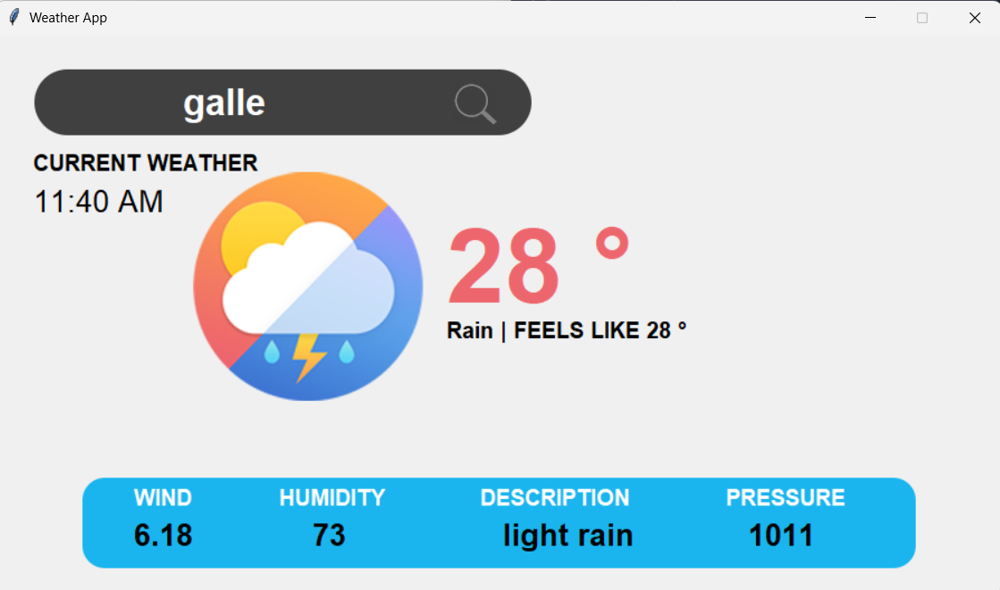

# Weather App 🌦️

A simple graphical weather application built using Python, Tkinter for the user interface, and the OpenWeatherMap API to fetch current weather data.

## Table of Contents

- [Overview](#overview)
- [Features](#features)
- [Prerequisites](#prerequisites)
- [Installation](#installation)
- [Usage](#usage)
- [Configuration](#configuration)
- [Screenshots](#screenshots)
- [Contributing](#contributing)

## Overview

The Weather App allows users to get real-time weather information for any city worldwide. By entering a city name, users can retrieve the current temperature, humidity, wind speed, and more. The app uses geolocation to determine the timezone and local time of the queried location.

## Features

- User-friendly GUI with Tkinter
- Displays current weather data including:
  - Temperature
  - Weather condition
  - Humidity
  - Wind speed
  - Atmospheric pressure
- Timezone and local time display for the searched city
- Real-time data from the OpenWeatherMap API

## Prerequisites

To run this application, you need to have the following installed:

- [Python](https://www.python.org/downloads/) 3.x
- [OpenWeatherMap API key](https://openweathermap.org/api) (free registration required)

## Installation

1. Clone the repository:

   ```bash
   git clone https://github.com/your-username/weather-app.git
   ```

2. Change to the project directory:

   ```bash
   cd weather-app
   ```

3. Install the required dependencies using pip:

   ```bash
   pip install -r requirements.txt
   ```

   Ensure your `requirements.txt` includes the following packages:

   ```
   geopy
   timezonefinder
   requests
   pytz
   tkinter (if not bundled with Python)
   ```

## Usage

1. Run the application:

   ```bash
   python WeatherApp.py
   ```

2. Enter a city name in the search bar and click the search icon or press Enter.
3. The application will fetch and display the current weather details for the specified city.

## Configuration

- Ensure that your OpenWeatherMap API key is correctly specified in the code. Replace the placeholder API key (`7818eb4cf493344d0df54ea29a34452f`) with your actual key.

  ```python
  api = f"https://api.openweathermap.org/data/2.5/weather?lat={location.latitude}&lon={location.longitude}&appid=YOUR_API_KEY"
  ```

## Screenshots

  
*Example of the weather app displaying weather data for a city.*

## Contributing

Contributions are welcome! If you'd like to improve the app, please:

1. Fork the repository.
2. Create a new branch (`git checkout -b feature-branch`).
3. Commit your changes (`git commit -m 'Add new feature'`).
4. Push to the branch (`git push origin feature-branch`).
5. Open a pull request.
